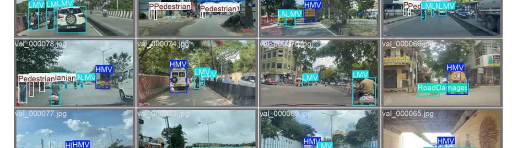

# Target Detection - Autonomous Driving Scenario Road Abnormality Detection Dataset with 8000 Images and Corresponding VOC/COCO/YOLO Format Labels + YOLO11 One-Click Training Script

5.8GB
Target Detection Autonomous Driving Scenario Road Abnormality Detection Dataset with 8000 Images_+ Corresponding VOC/COCO/YOLO Format Labels + YOLO11 One-Click Training Script●●●●●● Dataset Intro: 
The target detection road abnormality detection dataset is a high-quality real scene road image data set in the autonomous driving scenario, covering various scenes and rich categories. It is divided 
into six categories: "LMVs Light Vehicles (Automobiles, motorcycles, small cars, small trucks)", "HMVs Buses, cars, tractor, JCB excavator, box van"", "Road Damages Road Damages (ruts, cracks, bumps, 
manhole covers)", "Unsurfaced Roads Unsurfaced Roads (unpaved roads)", "Pedestrians Pedestrians (side pedestrians or crossing traffic pedestrians)", "Speed Bumps Speed Bumps (speed bumps and speed 
breaks)".

Applicable for actual project applications: The target detection road abnormality detection project, as well as a supplementary dataset for general road detection in the autonomous driving scenario.

Annotation Instructions: Labeled using labelimg software for high-quality annotation, providing VOC(xml), COCO (json), YOLO (txt) common target detection dataset formats directly applicable to 
algorithms such as YOLO training;

## Images

Here is a pay link on Stripe ( https://buy.stripe.com/3cs8yP7sY87d0vu9AB ). Please contact me lonlonago@foxmail.com after funding $89, and I will send you a complete data files , thank you!

